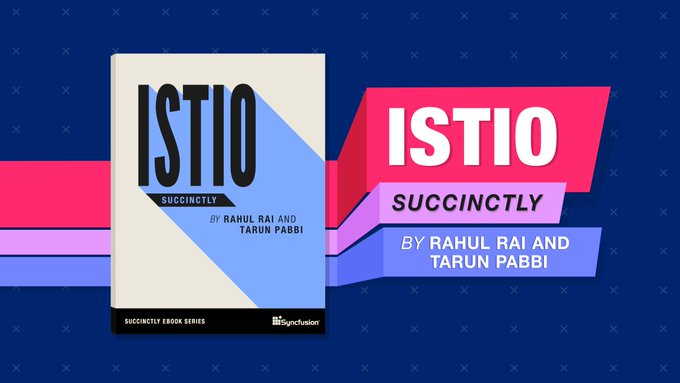

# Policies

> Companion repo for the title [**Istio Succinctly**](https://www.syncfusion.com/ebooks/istio-succinctly) by Syncfusion.

[](https://www.syncfusion.com/ebooks/istio-succinctly)

This repo contains the Istio YAML specifications used in the title- Istio Succinctly.

## Istio Succinctly

Download [**Istio Succinctly**](https://www.syncfusion.com/ebooks/istio-succinctly) for free from Syncfusion.

## How to use this repo

The specifications in this repo are segregated by the chapters of the book. We have duplicated necessary specifications across folders so that you do not have to move back and forth between folders of this repository while reading a chapter of the book. We recommend that you download this repo so that you can easily switch between folders.

### Important Note

In general, throughout the book, we discuss a policy specification and then instruct you to apply the specification to the cluster. When you wish to apply a specification that is mentioned in a chapter to the cluster, you should locate the file in the corresponding folder of the repo.

For example, in chapter #3, you are required to execute the following command to deploy the _fruits-api_ service to the Kubernetes cluster.

```shell
kubectl apply -f fruits-api.yml
```

The file- _fruits-api.yml_ is present at [Policies/Chapter 3/fruits-api.yml](https://github.com/Istio-Succinctly/Policies/blob/master/Chapter%203/fruits-api.yml).

## Chapter to folder mapping

| Chapter number | Name of the chapter         | Folder                                                                                 |
| -------------- | --------------------------- | -------------------------------------------------------------------------------------- |
| 3              | Envoy Proxy                 | [Link](https://github.com/Istio-Succinctly/Policies/tree/master/Chapter%203)           |
| 4              | Traffic Management - Part 1 | [Link](https://github.com/Istio-Succinctly/Policies/tree/master/Chapter%204%20and%205) |
| 5              | Traffic Management - Part 2 | [Link](https://github.com/Istio-Succinctly/Policies/tree/master/Chapter%204%20and%205) |
| 6              | Mixer Policies              | [Link](https://github.com/Istio-Succinctly/Policies/tree/master/Chapter%206)           |
| 7              | Security                    | [Link](https://github.com/Istio-Succinctly/Policies/tree/master/Chapter%207)           |
| 8              | Observability               | [Link](https://github.com/Istio-Succinctly/Policies/tree/master/Chapter%208)           |
